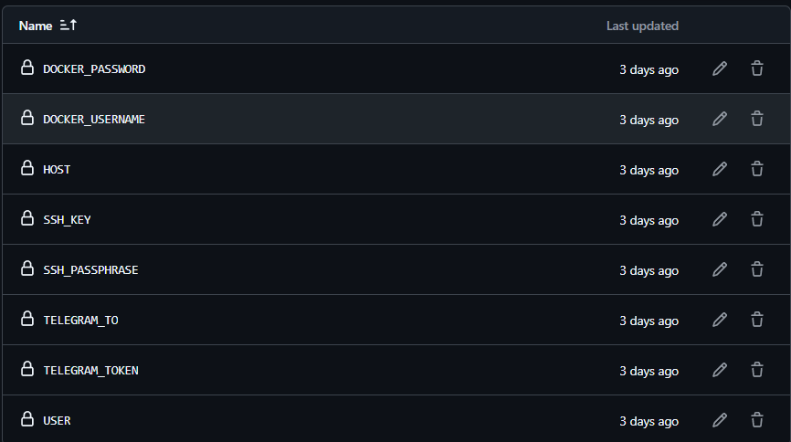
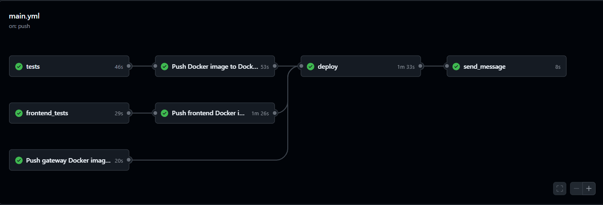

# Контейнеры и CI/CD для Kittygram

## 🚀 Ссылки

- 🐱 Репозиторий: [https://github.com/khamzaev/kittygram](https://github.com/khamzaev/kittygram)  
- 🌐 Развёрнутый проект: [https://kittygram-djamal.lt51.ru](https://kittygram-djamal.lt51.ru)

## Стек технологий


## Установка Docker Compose на сервер

Для установки Docker и Docker Compose на сервер выполните следующие команды:

```bash
sudo apt update
sudo apt install curl
curl -fSL https://get.docker.com -o get-docker.sh
sudo sh ./get-docker.sh
sudo apt install docker-compose-plugin
```

Скопируйте файл `docker-compose.production.yml` на сервер в директорию проекта с помощью следующей команды:

```bash
scp -i path_to_SSH/SSH_name docker-compose.production.yml \
    username@server_ip:/home/username/<директория проекта>/docker-compose.production.yml
```

- `path_to_SSH` — путь к файлу с SSH-ключом;
- `SSH_name` — имя файла с SSH-ключом (без расширения);
- `username` — ваше имя пользователя на сервере;
- `server_ip` — IP вашего сервера.

Скопируйте файл `.env` на сервер в директорию проекта:

```bash
scp -i path_to_SSH/SSH_name .env \
    username@server_ip:/home/username/<директория проекта>/.env
```

На сервере откройте файл конфигурации Nginx:

```bash
sudo nano /etc/nginx/sites-enabled/kittygram
```

Измените настройки `location` на следующие:

```nginx
location / {
    proxy_set_header Host $http_host;
    proxy_pass http://127.0.0.1:9000;
}
```

Перезагрузите конфигурацию Nginx:

```bash
sudo service nginx reload
```

## Workflow для обновления проекта на сервере

Для обновления проекта на сервере выполните следующие шаги:

1. Выполните команду `docker compose pull`, чтобы загрузить обновленные образы контейнеров с Docker Hub.
2. Перезапустите контейнеры с обновленными образами.

Чтобы автоматизировать этот процесс, настройте GitHub Actions в вашем репозитории. Перейдите в **Settings** → **Secrets and Variables** → **Actions** и добавьте необходимые секреты.



После настройки выполните коммит и пуш в репозиторий, чтобы проверить выполнение workflow.



---

Автор: [@khamzaev](https://github.com/khamzaev)
